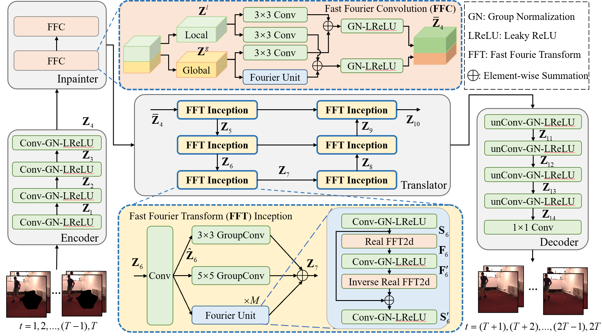
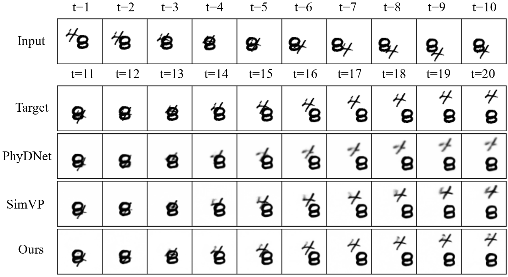
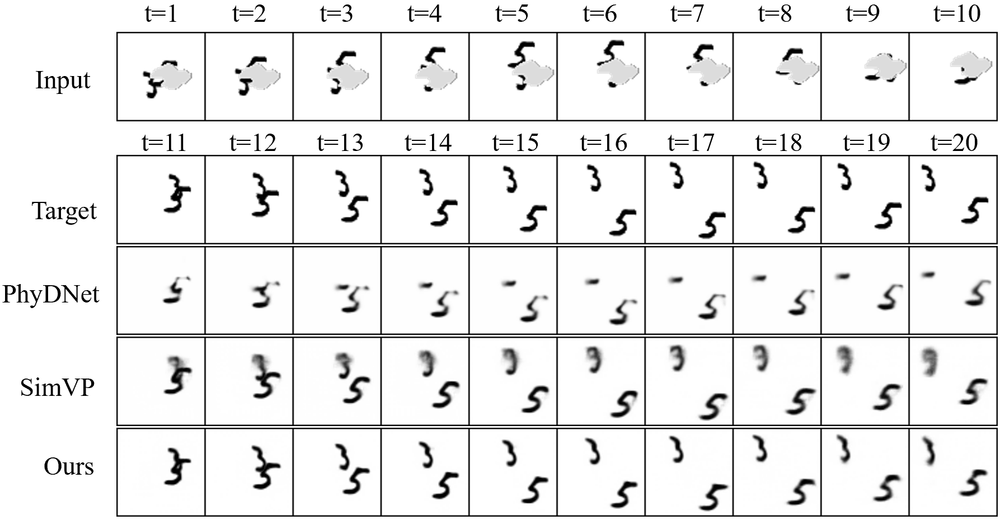

# FFINet

This repository contains the implementation code for paper:

**FFINet:FFast Fourier Inception Networks for Occluded Video Prediction**  

## Introduction

<p align="center">
     <br>
</p>

Abstract: We develop the fully convolutional Fast Fourier Inception Networks for video prediction, termed FFINet, which includes two primary components i.e.,the occlusion inpainterand the spatiotemporal translator. The former adopts the fast Fourier convolutions to enlarge the receptive field, such that the missing areas (occlusion) with complex geometric structures are filled by the inpainter. The latter employs the stacked Fourier transform inception module to learn the temporal evolution by group convolutions and the spatial movement by channel-wise Fourier convolutions which captures both the local and the global spatiotemporal features.This encourages generating more realistic future frames. 

## Dependencies

* torch=1.9.0
* scikit-image=0.19.3
* numpy=1.21.5
* argparse
* tqdm=4.64.1
* addict=2.4.0
* fvcore=0.1.5
* hickle=5.0.2
* opencv-python=4.6.0
* pandas=1.3.5
* pillow=9.2.0

## Overview

* `API/` contains dataloaders and metrics.
* `main.py` is the executable python file with possible arguments.
* `model.py` contains the FFINet model.
* `exp.py` is the core file for training, validating, and testing pipelines.
* `modules.py` contains the component  such as FFT Inception and FourierUnit.

## Prepare Dateset

```
  python mask_generator.py      #produce the mask for test
  cd ./data/moving_mnist        
  bash download_mmnist.sh       #download the mmnist dataset
```

## Start Training

```
  cd ./script
  sh mnist_train_nomask.sh      #train the model without mask
  sh mnist_tarin_mask.sh        #tarin the model with mask
```

## Quantitative results on Moving MNIST

|                 | MSE  | MAE  | SSIM  |
|:---------------:|:----:|:----:|:-----:|
| FFINet wo/ mask | 19.2 | 60.4 | 0.958 |
| FFINet w/ mask  | 21.7 | 65.8 | 0.952 |

## Qualitative results on Moving MNIST

without maks

<p align="center">
     <br>
</p>

with mask

<p align="center">
     <br>
</p>

```
Citation

If you find this repo useful, please cite the following papers.
```
## Contact
If you have any questions, feel free to contact us through email (201050044@hdu.edu.cn)

## Acknowledgements
We would like to thank to the authors of [SimVP](https://ieeexplore.ieee.org/stamp/stamp.jsp?tp=&arnumber=9879439) for making their [source code](https://github.com/gaozhangyang/SimVP-Simpler-yet-Better-Video-Prediction) public which significantly accelerated the development of FFINet.
