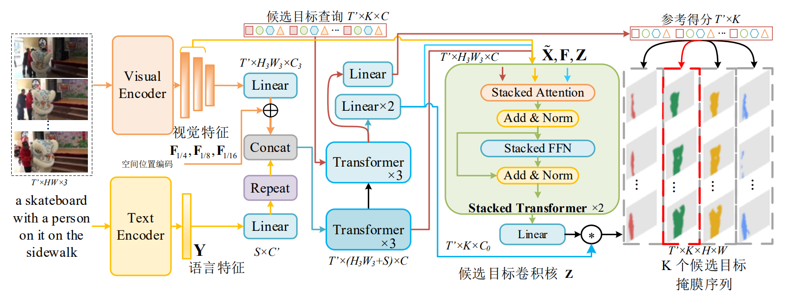
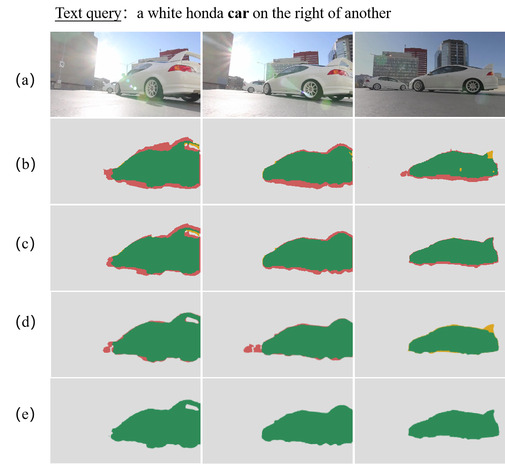

# Fully Transformer-Equipped Architecture for End-to-End Referring Video Object Segmentation


## Introduction


In order to address the task of video object segmentation based on reference sentences, this paper introduces the first RVOS (Reference-based Video Object Segmentation) model entirely built upon Transformers. This model is capable of distinguishing target regions in videos at the pixel level when provided with natural language instructions. To achieve this, the paper proposes a Stacked Transformer module that decodes visual feature maps into multiple candidate target masks, facilitating context learning and decoding at the candidate target level. Additionally, to ensure that the segmentation process accurately identifies all candidate targets, a diversity loss for dynamic convolution kernels during candidate target generation is introduced.
<p align="center">

</p>

## Installation

The code was tested on a Conda environment installed on Ubuntu 18.04.

Install [Conda](https://docs.conda.io/en/latest/miniconda.html) and then create an environment as follows:
- Python 3.9.7:

```
conda create -n ftea python=3.9.7
```

```
conda activate ftea
```
- Pytorch 1.10
- CUDA 12.0
- OpenCV 4.7.0

```
conda install pytorch==1.10.0 torchvision==0.11.1 -c pytorch -c conda-forge
```


```setup
pip install transformers==4.11.3 h5py wandb opencv-python protobuf av einops ruamel.yaml timm joblib pycocotools
```

```
conda install -c conda-forge pandas matplotlib cython scipy cupy
```


## Dataset Requirements

### A2D-Sentences

Follow the instructions [here](https://kgavrilyuk.github.io/publication/actor_action/) to download the dataset.

Then, extract and organize the files inside your cloned repo directory as follows (note that only the necessary files are shown):

```text
RVOS/
└── a2d_sentences/
  ├── Release/
  │  ├── videoset.csv  (videos metadata file)
  │  └── CLIPS320/
  │    └── *.mp4   (video files)
  └── text_annotations/
    ├── a2d_annotation.txt  (actual text annotations)
    ├── a2d_missed_videos.txt
    └── a2d_annotation_with_instances/
      └── */ (video folders)
        └── *.h5 (annotations files)
```

### JHMDB-Sentences

Follow the instructions [here](https://kgavrilyuk.github.io/publication/actor_action/) to download the dataset.

Then, extract and organize the files inside your cloned repo directory as follows (note that only the necessary files are shown):

```text
RVOS/
└── jhmdb_sentences/
  ├── Rename_Images/  (frame images)
  │  └── */ (action dirs)
  ├── puppet_mask/  (mask annotations)
  │  └── */ (action dirs)
  └── jhmdb_annotation.txt  (text annotations)
```

### Ref-YouTube-VOS

Download the dataset from the competition's website [here](https://competitions.codalab.org/competitions/29139#participate-get_data).

Note that you may be required to sign up to the competition in order to get access to the dataset. This registration process is free and short.Then, extract and organize the files inside your cloned repo directory as follows (note that only the necessary files are shown):

```text
RVOS/
└── refer_youtube_vos/
  ├── train/
  │  ├── JPEGImages/
  │  │  └── */ (video folders)
  │  │    └── *.jpg (frame image files)
  │  └── Annotations/
  │    └── */ (video folders)
  │      └── *.png (mask annotation files)
  ├── valid/
  │  └── JPEGImages/
  │    └── */ (video folders)
  │      └── *.jpg (frame image files)
  └── meta_expressions/
    ├── train/
    │  └── meta_expressions.json  (text annotations)
    └── valid/
      └── meta_expressions.json  (text annotations)
```

## Running Configuration

The following table lists the parameters which can be configured directly from the command line. The rest of the running/model parameters for each dataset can be configured in `configs/DATASET_NAME.yaml`. Note that in order to run the code the path of the relevant `.yaml` config file needs to be supplied using the `-c` parameter.

| Command | Description                                                  |
| ------- | ------------------------------------------------------------ |
| -c      | path to dataset configuration file                           |
| -rm     | running mode (train/eval)                                    |
| -ws     | window size                                                  |
| -bs     | training batch size per GPU                                  |
| -ebs    | eval batch size per GPU (if not provided, training batch size is used) |
| -ng     | number of GPUs to run on                                     |

## Training
First, download the Kinetics-400 pretrained weights of Video Swin Transformer from this [link](https://drive.google.com/file/d/1BF3luuKVTyxve1kFK_2bxtsST2kH7u1P/view?usp=sharing).  Note that these weights were originally published in video swin's original repo [here](https://github.com/SwinTransformer/Video-Swin-Transformer).Place the downloaded file inside your cloned repo directory as `./pretrained_swin_transformer/swin_tiny_patch244_window877_kinetics400_1k.pth`.

Next, run `bash train.sh` to train the model(s) in the paper,.

```
python main.py -rm train -c configs/a2d_sentences.yaml -ws 8 -bs 2 -ng 2
# -c can be replaced with configs/refer_youtube_vos.yaml
# -ws is video frame number in a video clip
# -bs is batch size
# -ng is gpu number
```

## Pre-trained Models

You can download pretrained models here:

- [Best model on A2D Sentences](https://pan.baidu.com/s/1E8R5gm9Ko2GUFdwPBLBnsw) . Code: bysa.
## Evaluation

The following commands can be used to reproduce the main results of our paper using the supplied checkpoint files. Set checkpoint file path in test.sh. Run `bash test.sh`.

## Quantitative results on J-HMDB Sentences.

|  Method |  mAP   |  Overall Iou  | Mean Iou |
|:-------:|:------:|:----:|:-------:|
| FTEA  | 38.7 | 70.1 |  69.5   |

## Qualitative results 


<p align="center">
     <br>
</p>

Qualitative comparison between the baseline and our model on Refer YouTubu VOS validation set. (a)Video clip frames; (b)URVOS; (c)CMPC-V	; (d)MTTR; (e)FTEA}
## Citation

If you find this repo useful, please cite the following paper.
```
@article{li-FTEA,
  author    = {Ping Li, Yu Zhang, Li Yuan, Xianghua Xu},
  title     = {Fully Transformer-Equipped Architecture for End-to-End Referring Video Object Segmentation},
  journal   = {arXiv},
  year      = {2023},
  doi       = {https://doi.org/10.48550/arXiv.2309.11933},
}
```
## Contact
If you have any questions, please contact Mr. Zhang Yu via email at zycs@hdu.edu.cn.

## Acknowledgement
We would like to thank the authors of [MTTR](https://github.com/mttr2021/MTTR)which have significantly accelerated the development of our FTEA model.