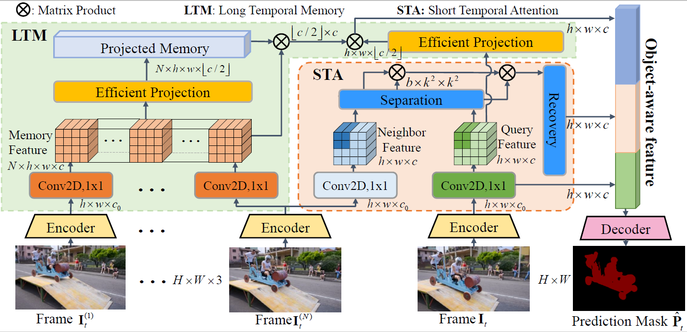

# Efficient Long-Short Temporal Attention Network for Unsupervised Video Object Segmentation

## Introduction

Efficient Long-Short Temporal Attention Network  (LSTA) is a framework for unsupervised video object segmentation task. Our method captures long and short range spatial temporal relation of each frame pixels using proposed Light Temporal Memory(LTM) and Short Temporal Attention(STA). Both LTM and STA has a linear time complexity, resulting 42.8 FPS segmentation speed on DAVIS 16 val (480p resolution) 
using TITAN XP GPU card.
<p align="center">

</p>

## Installation

1. Environment:

   - Python 3.8

   - PyTorch 1.8
   - CUDA 11.1
   - OpenCV 4.5.2
```
conda create -n LSTA python=3.8 & y
conda activate LSTA
conda install pytorch==1.8.0 torchvision==0.9.0 torchaudio==0.8.0 cudatoolkit=11.1 -c pytorch -c conda-forge
pip install opencv-python
```

2. Dataset preparation:
   - DAVIS 2017: put under `data/DAVIS/`.
   - YouTube-VOS 2019: put under `data/YTB/`.
After downloding the datastes, use commands below to generate soft link.
```
ln -s /path/to/DAVIS/* data/DAVIS/
ln -s /path/to/YouTube-VOS/2019/* data/YTB/
```

Once you finished the commands, the data file should be like:

```
data/
├── DAVIS
│   ├── Annotations -> /data16t/data/DAVIS/DAVIS/Annotations
│   ├── ImageSets -> /data16t/data/DAVIS/DAVIS/ImageSets
│   ├── JPEGImages -> /data16t/data/DAVIS/DAVIS/JPEGImages
│   ├── README.md -> /data16t/data/DAVIS/DAVIS/README.md
│   ├── readme.txt
│   └── SOURCES.md -> /data16t/data/DAVIS/DAVIS/SOURCES.md
└── YTB
    ├── readme.txt
    ├── train -> /data16t/data/YTB/2019/train
    ├── train.zip -> /data16t/data/YTB/2019/train.zip
    ├── valid -> /data16t/data/YTB/2019/valid
    └── valid.zip -> /data16t/data/YTB/2019/valid.zip
```
## Training
Put the following weights under `pretrained`.
- STM weight from this [url](https://github.com/seoungwugoh/STM).
- resnet101-deeplabv3p.pth from this  [url](https://pytorch.org/hub/pytorch_vision_deeplabv3_resnet101/). 

All the configurations are in `config.py`. In order to train on DAVIS and YouTube-VOS, you should change the `self.DATASETS = ['youtubevos', 'davis2017']` to `self.DATASETS = [ 'davis2017']` in first step training with `self.TRAIN_TOTAL_STEPS = 50000`.
Then use the following command to start training. 
```
bash train.sh
```
In order to train on DAVIS and YouTube-VOS, you should set  `self.DATASETS = ['youtubevos', 'davis2017']`  and  `self.TRAIN_TOTAL_STEPS = 25000`.
Then use the `bash train.sh` command to start training. 

## Testing

- Best [LSTA]() model. Code: kgdu .
Download and put the model weights under current dir. Run following command, the segmentation results of DAVIS 16 val set will generated under `log` dir.

```
bash eval.sh
```

## Quantitative results on DAVIS-16

|       |  J   |  F   | average |
|:-----:|:----:|:----:|:-------:|
| LSTA  | 82.4 | 84.3 |  83.4   |
| LSTA* | 82.7 | 84.8 |  83.8   |

## Acknowledgement

We borrowed some codes from [CFBI](https://github.com/z-x-yang/CFBI) and [anchor-diff-VOS](https://github.com/yz93/anchor-diff-VOS). Thanks for their excellent works!

